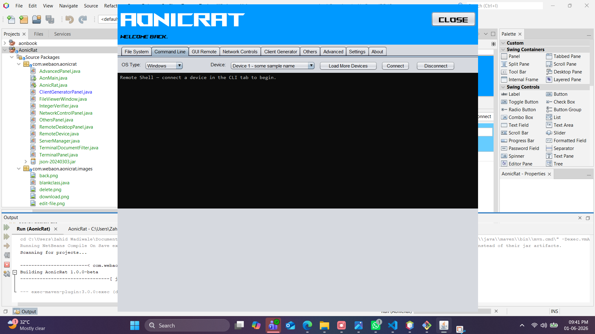
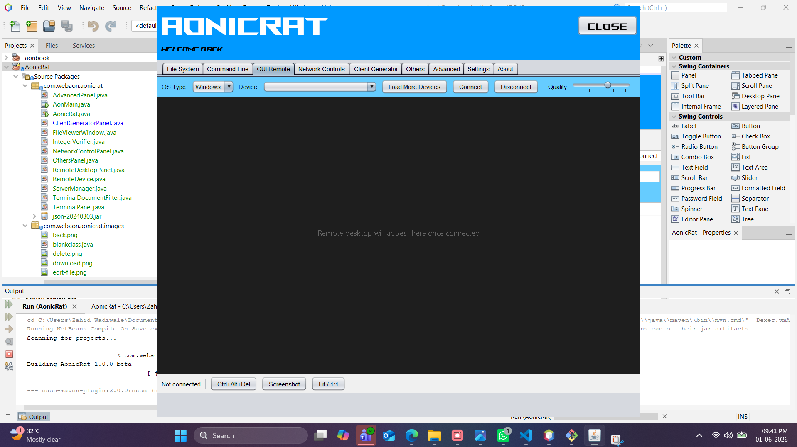
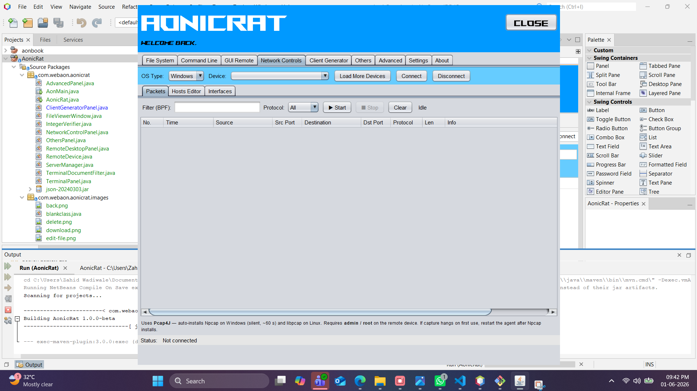
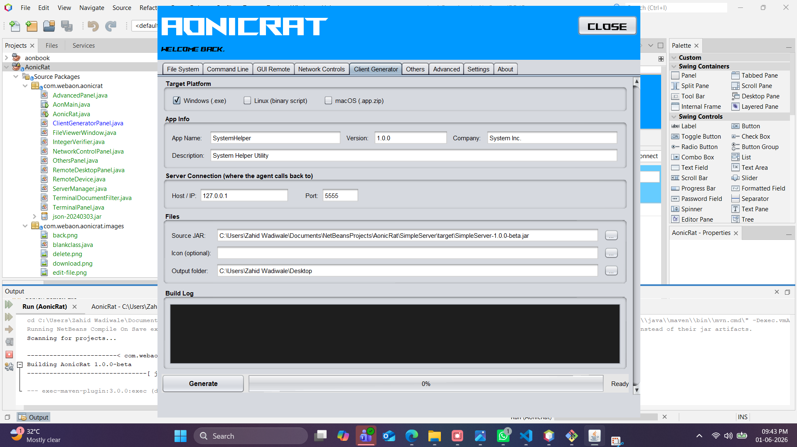
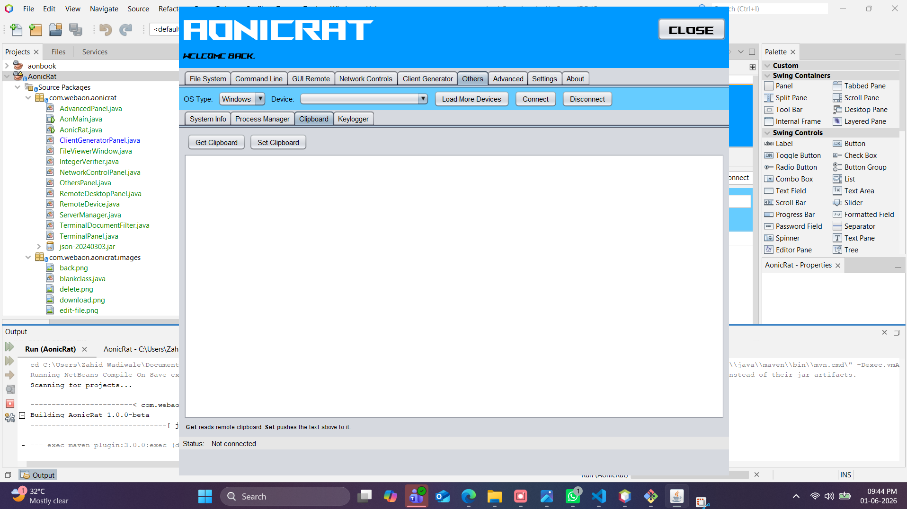
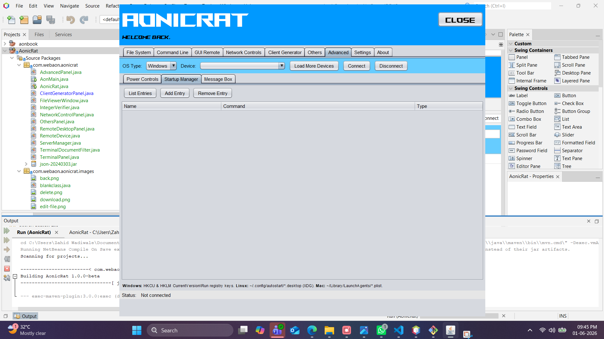
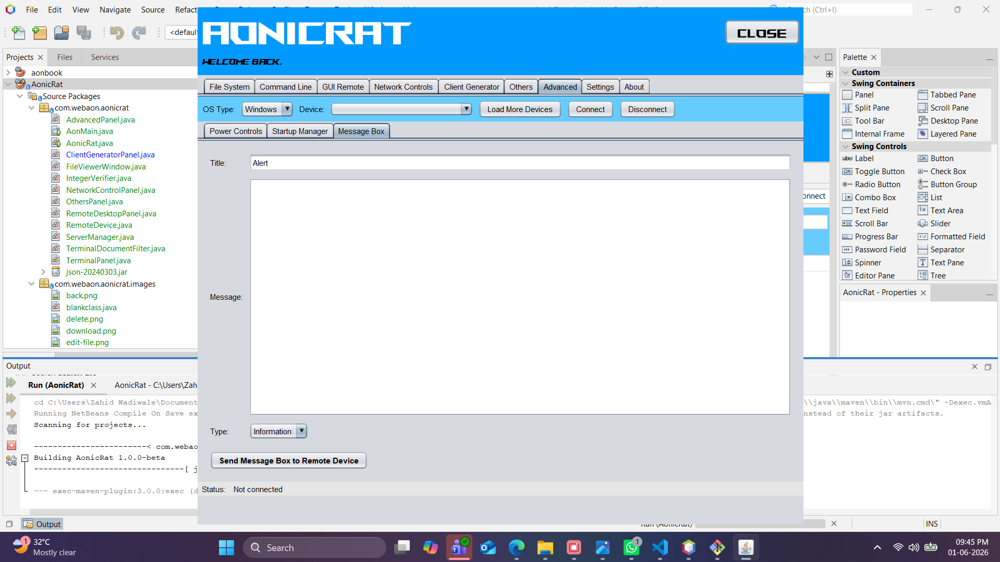
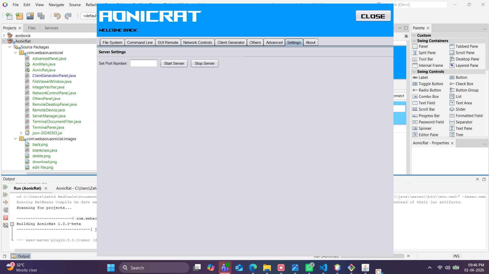
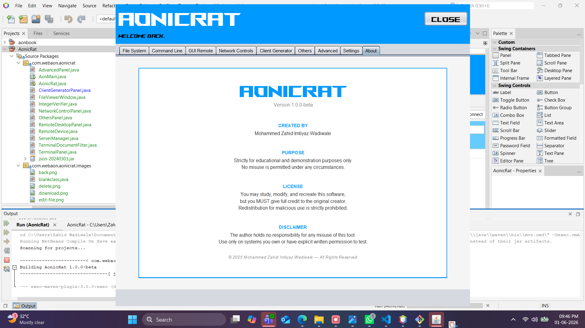

# AonicRAT

**Version:** 1.0.0-beta  
**Created by:** Mohammed Zahid Imtiyaz Wadiwale  
**Purpose:** Educational — Understanding Enterprise-Grade Remote Administration & Access Tools

---

## What is AonicRAT?

AonicRAT is a fully functional, Java-based **Remote Administration Tool (RAT)** built from scratch for **educational and demonstration purposes only**.

The goal of this project is to teach students, developers, and security researchers how **enterprise-grade Remote Server Administration Tools (RSATs)** and **Remote Access Tools (RATs)** work under the hood — tools like:

| Tool | What it does |
|------|-------------|
| **TeamViewer / AnyDesk** | Remote desktop, file transfer, remote shell |
| **DameWare / ManageEngine** | Enterprise IT remote endpoint administration |
| **Cobalt Strike / Metasploit** | Professional penetration testing C2 frameworks |
| **PDQ Deploy / Ansible** | Remote startup management, command execution |
| **Wireshark + remote agents** | Remote packet capture and network inspection |

By studying AonicRAT you will understand the core technical concepts behind:
- Client-server architecture for remote control
- Reverse TCP connection model (agent calls back to controller)
- Persistent socket-based communication
- Remote file system operations over a network
- Live interactive shell/terminal streaming
- Real-time screen capture and remote desktop viewing
- Cross-platform agent generation (Windows, Linux, macOS)
- Remote network packet capture and hosts file editing
- Remote process management and system information gathering
- Remote clipboard access and keylogging
- Remote power controls and startup entry management
- Remote message box / alert delivery

---

## Cross-Platform Support

Both the **Controller** and the **Agent** run on any major operating system. There are no platform restrictions on either side.

| Component | Windows | Linux | macOS |
|-----------|:-------:|:-----:|:-----:|
| **Controller (AonicRat)** | ✅ | ✅ | ✅ |
| **Agent (SimpleServer)** | ✅ | ✅ | ✅ |

This means:
- A **Windows** operator can control a **Linux** or **macOS** target — and vice versa
- A **Linux** operator can control a **Windows** machine
- A **macOS** operator can control a **Windows** or **Linux** machine
- Any combination works — the protocol is platform-agnostic over TCP

Both components are written in **pure Java**, so they run on any OS with a compatible JVM (Java 11+ for the agent, Java 18+ for the controller) — no native dependencies, no OS-specific installers required.

---

## Architecture Overview

AonicRAT is split into two components:

```
AonicRat/
├── src/                  ← Controller (the operator's dashboard)
└── SimpleServer/         ← Agent (deployed on the target machine)
```

| Component | Role |
|-----------|------|
| **Controller** | The operator's GUI dashboard. Manages connected devices, sends commands, receives data. Runs on Windows, Linux, or macOS. |
| **Agent (SimpleServer)** | Runs on the target machine. Connects back to the controller, executes commands, streams results. Runs on Windows, Linux, or macOS. |

### Reverse Connection Model

```
[ Agent / SimpleServer ]  ──connect──▶  [ Controller / AonicRat ]
   Windows / Linux / macOS                 Windows / Linux / macOS
      (initiates connection)                  (listens on a port)
```

The agent uses a **reverse TCP connection** — it calls back to the controller's IP and port on startup. This is the same model used by Metasploit Meterpreter, Cobalt Strike Beacon, and enterprise MDM agents. It works through NAT and firewalls because outbound connections are rarely blocked.

---

## Screenshots

### File System Tab


### Command Line Tab


### GUI Remote Tab


### Network Controls — Packet Capture


### Network Controls — Hosts Editor


### Network Controls — Interfaces


### Client Generator Tab


### Others — System Info


### Others — Process Manager


### Others — Clipboard


### Others — Keylogger


### Advanced — Power Controls


### Advanced — Startup Manager


### Advanced — Message Box


### Settings Tab


### About Tab


---

## Features

---

### 1. File System


A full remote file manager that lets the operator browse and manage the file system of any connected device.

**Capabilities:**
- Browse the complete remote file system — drives, folders, files
- Navigate directories by double-clicking folders; use `..` to go up one level
- Back and Forward navigation buttons (like a file explorer)
- View file names, sizes, types, and last-modified timestamps in a sortable table
- **Upload** files from the operator machine to the remote device
- **Download** files from the remote device to the operator machine with a progress bar
- **Delete** files and folders remotely
- **Rename** files and folders remotely
- **Zip** files/folders on the remote device
- **Extract** ZIP archives on the remote device
- **View** text-based files directly in the controller (opens a built-in viewer)
- **Edit** text-based files remotely and save changes back

> **What you learn:** How tools like TeamViewer File Transfer, WinSCP, and enterprise MDM file managers implement remote file operations over a persistent socket. File metadata (size, type, modified date) is transferred alongside file listings, exactly like enterprise FTP/SFTP clients.

---

### 2. Command Line (Terminal)


A fully interactive persistent remote shell — the remote machine's terminal streamed live to the operator.

**Capabilities:**
- Opens a **persistent interactive shell** on the remote device (`cmd.exe` on Windows, `bash`/`sh` on Linux/macOS)
- Streams **real-time output** character-by-character back to the controller
- Fully interactive — run any command, execute scripts, navigate directories, launch programs
- Session-based — the shell process stays alive across multiple commands (not one-shot execution)
- Color-coded terminal output with a dark console theme
- Device selector to switch between connected devices

> **What you learn:** How SSH, Telnet, and C2 framework shells (Cobalt Strike interactive shell, Metasploit Meterpreter shell) maintain a persistent interactive session over a TCP socket. The difference between one-shot command execution and a persistent PTY-like session.

---

### 3. GUI Remote (Remote Desktop)


A remote desktop viewer that captures and streams the remote machine's screen to the operator in real time.

**Capabilities:**
- Captures the remote machine's screen and streams frames to the controller
- Live display of the remote desktop inside the controller window
- **Ctrl+Alt+Del** — sends the secure attention sequence to the remote machine
- **Screenshot** — captures and saves the current remote screen as an image
- **FPS control** — adjust the frame rate of the screen stream
- Quality controls for bandwidth/quality tradeoff
- "Not connected" state with clear status indication

> **What you learn:** How VNC (Virtual Network Computing), Microsoft RDP (Remote Desktop Protocol), TeamViewer, and AnyDesk implement screen capture, image compression, and frame streaming. The tradeoff between FPS, image quality, and network bandwidth.

---

### 4. Network Controls

The Network Controls tab has three sub-tabs covering different aspects of remote network inspection and management.

---

#### 4a. Packet Capture


A remote packet sniffer that captures live network traffic on the target device.

**Capabilities:**
- Capture live network packets on the remote machine
- Filter by protocol (All, IP, TCP, UDP, etc.)
- Displays packet details in a table: No., Time, Source, Src Port, Destination, Dst Port, Protocol, Length, Info
- **Clear** captured packets
- Start and stop capture sessions

> **Note:** Requires admin/root privileges on the remote device. On Windows, uses raw socket capture; on Linux, uses `/dev/input` level capture (requires root).

> **What you learn:** How tools like Wireshark with remote capture, tcpdump, and enterprise SIEM network agents capture and stream raw network packets from remote endpoints to a central analysis console.

---

#### 4b. Hosts Editor


A remote editor for the target machine's `hosts` file — the system-level DNS override table.

**Capabilities:**
- View all current entries in the remote machine's `hosts` file (IP Address, Hostname, Comment)
- **Add** new hostname-to-IP mappings remotely
- **Delete** existing entries remotely
- **Save to Remote** — write changes back to the remote hosts file
- **Quick Redirect** — rapidly redirect a hostname to a specified IP (e.g., redirect to `127.0.0.1`)

> **What you learn:** How enterprise network management tools, DNS filtering appliances, and parental control software manipulate the system hosts file remotely to override DNS resolution. The hosts file takes priority over DNS — a fundamental concept in network administration and security testing.

---

#### 4c. Network Interfaces


Displays a complete inventory of all network interfaces on the remote machine.

**Capabilities:**
- Lists all network interfaces with: Interface name, IPv4 address, IPv6 address, MAC address, MTU, and Status (Up/Down)
- **Refresh** to update the interface list on demand

> **What you learn:** How enterprise asset management tools, vulnerability scanners, and network monitoring platforms enumerate remote network interfaces — essential for network topology mapping and identifying active adapters.

---

### 5. Client Generator


Generates platform-specific agent executables from the SimpleServer JAR — the core of understanding how enterprise deployment and C2 frameworks package and deploy agents.

**Capabilities:**
- **Target Platform selection:** Windows (`.exe`), Linux (self-extracting binary script), macOS (`.app.zip` bundle)
- **App Info customisation:** Set the agent's app name, version, company name, and description (used for Windows PE metadata)
- **Server Connection:** Configure the controller's Host/IP and Port that the agent will call back to — injected into `aon.properties` inside the JAR at build time
- **Source JAR:** Select the SimpleServer fat JAR as the base agent
- **Icon:** Optionally embed a custom icon (`.ico` for Windows, `.icns` for macOS)
- **Output Folder:** Choose where the generated executables are saved
- **Windows `.exe`:** Uses Launch4j (auto-downloaded from SourceForge) to wrap the JAR into a native Windows executable with full version info, PE metadata, and icon
- **Linux binary:** Creates a self-extracting shell script with the JAR base64-encoded inside — no tools required on the build machine
- **macOS `.app`:** Creates a proper macOS application bundle (`Contents/MacOS/`, `Info.plist`, optional `.icns` icon) and zips it
- **Build Log:** Real-time log showing each generation step and output file sizes
- **Progress bar:** Visual indicator of the generation process

> **What you learn:** How `msfvenom` (Metasploit), Cobalt Strike's artifact kit, and enterprise MDM deployment tools generate and configure platform-specific agent executables. How PE metadata, app bundles, and self-extracting scripts work. How server configuration (IP/port) is embedded into an agent at generation time.

---

### 6. Others

The Others tab exposes additional remote system information and control capabilities across four sub-tabs.

---

#### 6a. System Info


Retrieves and displays comprehensive system information from the remote device.

**Capabilities:**
- Displays key system properties in a Name/Value table
- OS name, version, architecture
- CPU information
- Total/available RAM
- Username and hostname
- Java runtime version on the remote machine
- System uptime and other environment details

> **What you learn:** How enterprise asset management tools (ManageEngine, SCCM) and penetration testing frameworks perform system fingerprinting/enumeration on remote hosts.

---

#### 6b. Process Manager


A remote task manager showing all running processes on the target device.

**Capabilities:**
- Lists all running processes: PID, Process Name, Memory usage
- **Kill Process** — terminate any selected process remotely
- Real-time process list from the remote machine

> **What you learn:** How remote administration tools like Process Hacker (remote mode), Sysinternals PsKill, and C2 frameworks enumerate and terminate processes on remote endpoints — a core technique in both IT administration and security testing.

---

#### 6c. Clipboard


Remote clipboard access — read and write the clipboard of the target device.

**Capabilities:**
- **Get Clipboard** — retrieves the current clipboard content from the remote machine and displays it
- **Set Clipboard** — pushes custom text to the remote machine's clipboard

> **What you learn:** How remote access tools implement clipboard synchronisation (like TeamViewer's clipboard sync feature) and how clipboard access is used in both legitimate remote support and security research.

---

#### 6d. Keylogger


A remote keylogger that captures keystrokes on the target machine.

**Capabilities:**
- **Start** — begins capturing keystrokes on the remote machine
- **Stop** — stops keystroke capture
- **Clear** — clears the captured keylog output
- **Idle** status indicator

**Platform implementation notes (shown in the UI):**
- **Windows:** Uses `GetAsyncKeyState` Win32 API
- **Linux:** Uses `/dev/input/eventN` (requires root)
- **macOS:** Uses the Accessibility API (requires root/accessibility permissions)

> **What you learn:** How keyloggers are implemented across different operating systems at the API level. This is a critical concept in security research — understanding how keyloggers work is essential to defending against them (endpoint detection, API hooking detection, input protection).

---

### 7. Advanced

The Advanced tab provides power-level remote control capabilities split across three sub-tabs.

---

#### 7a. Power Controls


Remote power management — control the power state of the target device.

**Capabilities:**
- **Shutdown** — remotely shuts down the target machine
- **Restart** — remotely restarts the target machine
- **Sleep** — puts the target machine into sleep/suspend mode
- **Lock Screen** — locks the target machine's screen (requires re-authentication)
- **Log Off** — logs off the current user session

**Platform commands used (shown in UI):**
- **Windows:** `shutdown /s /t 0`, `shutdown /r`, `rundll32 powrprof.dll,SetSuspendState`, `rundll32 user32.dll,LockWorkStation`, `shutdown /l`
- **Linux:** `shutdown`, `reboot`, `systemctl suspend`, `loginctl lock-session`
- **macOS:** `osascript` with System Events

> **What you learn:** How enterprise IT management platforms (ManageEngine, SCCM, PDQ Deploy) and remote admin tools implement remote power management. Understanding which OS APIs and shell commands control power states.

---

#### 7b. Startup Manager


View and manage programs that automatically start on the remote device.

**Capabilities:**
- Lists all startup entries with: Name, Command, Type (Registry/Folder/etc.)
- **Add Entry** — add a new startup entry to the remote machine
- **Remove Entry** — delete a startup entry from the remote machine

**Platform implementation:**
- **Windows:** Registry keys (`HKCU\Software\Microsoft\Windows\CurrentVersion\Run`, `HKLM\...`) and Startup folder
- **Linux:** `~/.config/autostart`, crontab `@reboot`
- **macOS:** LaunchAgents (`~/Library/LaunchAgents/`)

> **What you learn:** How malware achieves persistence (a critical concept in malware analysis), and how enterprise IT tools audit and manage auto-start programs across a fleet of devices. Startup management is a fundamental topic in both system administration and endpoint security.

---

#### 7c. Message Box


Send a pop-up message box / alert dialog to the remote device's screen.

**Capabilities:**
- **Title** — set the message box title (e.g., "Alert", "Notice", "System Warning")
- **Message** — compose the message body text
- **Type** — choose the dialog type: Information, Warning, Error, Question
- **Send Message Box to Remote Device** — delivers the dialog instantly to the remote machine's screen

> **What you learn:** How enterprise IT helpdesk tools and system administrators broadcast on-screen notifications to remote machines (used in scheduled maintenance alerts, security warnings, and IT communications). Also demonstrates how remote UI interaction works at the OS dialog level.

---

### 8. Settings


Controller server configuration.

**Capabilities:**
- **Set Port Number** — configure which port the controller listens on for incoming agent connections (default: 5555)
- **Start Server** — start the controller's listening server to accept agent connections
- **Stop Server** — stop the server and disconnect all agents

> **What you learn:** How C2 (Command and Control) servers and enterprise management servers bind to ports, accept incoming agent connections, and manage their lifecycle — the foundation of any client-server remote administration architecture.

---

### 9. About


Project information, credits, license, and legal disclaimer.

---

## Requirements

| Component | OS Support | Java Requirement |
|-----------|-----------|-----------------|
| **Controller (AonicRat)** | Windows, Linux, macOS | Java 18 or higher |
| **Agent (SimpleServer)** | Windows, Linux, macOS | Java 11 or higher |
| **Build tool** | Any | Apache Maven 3.x |
| **IDE (optional)** | Any | Apache NetBeans 15+ |

> Both components are pure Java — no native code, no OS-specific installers. Any machine with a compatible JVM can run either component.

---

## Building & Running

### Build the Controller

```bash
cd AonicRat
mvn clean package
java -jar target/AonicRat-1.0.0-beta.jar
```

### Build the Agent

```bash
cd AonicRat/SimpleServer
mvn clean package
```

Agent JAR will be at `SimpleServer/target/SimpleServer-1.0.0-beta.jar`.

### Generate a Platform-Specific Agent

1. Launch the controller
2. Go to **Settings** tab → set port → click **Start Server**
3. Go to **Client Generator** tab
4. Set your controller's IP and port
5. Select target platform
6. Click **Generate**
7. Deploy the generated file to the target machine and run it
8. The agent will appear in the device list in all tabs

---

## Project Structure

```
AonicRat/
├── src/main/java/com/webaon/aonicrat/
│   ├── AonMain.java                ← Main controller window & all tab wiring
│   ├── ServerManager.java          ← Handles all agent connections & protocol
│   ├── ClientGeneratorPanel.java   ← Agent builder (Windows/Linux/macOS)
│   ├── RemoteDesktopPanel.java     ← Remote desktop screen viewer
│   ├── NetworkControlPanel.java    ← Packet capture, hosts editor, interfaces
│   ├── TerminalPanel.java          ← Interactive terminal UI
│   ├── AdvancedPanel.java          ← Power, startup, message box controls
│   ├── OthersPanel.java            ← System info, process manager, clipboard, keylogger
│   ├── RemoteDevice.java           ← Connected device model
│   ├── FileViewerWindow.java       ← Remote file content viewer/editor
│   └── images/                     ← UI toolbar icons
├── SimpleServer/                   ← Agent source code
├── pom.xml                         ← Maven build (fat JAR, all deps bundled)
├── README.md
└── LICENSE
```

---

## Legal & Ethical Use

> **This tool is strictly for educational and demonstration purposes.**

- Only use this tool on systems you **own** or have **explicit written permission** to test.
- Unauthorized use against systems you do not own is **illegal** under the Computer Fraud and Abuse Act (CFAA), the UK Computer Misuse Act (CMA), and equivalent laws worldwide.
- The author holds **zero responsibility** for any misuse of this software.
- This is a **proof of concept** built to aid learning — not a production attack tool.

---

## License

See [LICENSE](LICENSE) for full terms.

You are free to **study, modify, and build upon** this software, but you **must give full credit** to the original creator in any derivative work, fork, or publication.

---

## Credits

**Original Creator:** Mohammed Zahid Imtiyaz Wadiwale

Any derivative work, fork, redistribution, or publication based on this project must clearly and visibly credit the original author.

---

## Disclaimer

This software is provided "as is", without warranty of any kind.  
It is a proof-of-concept built purely for educational use.  
**No misuse is permitted under any circumstances.**
